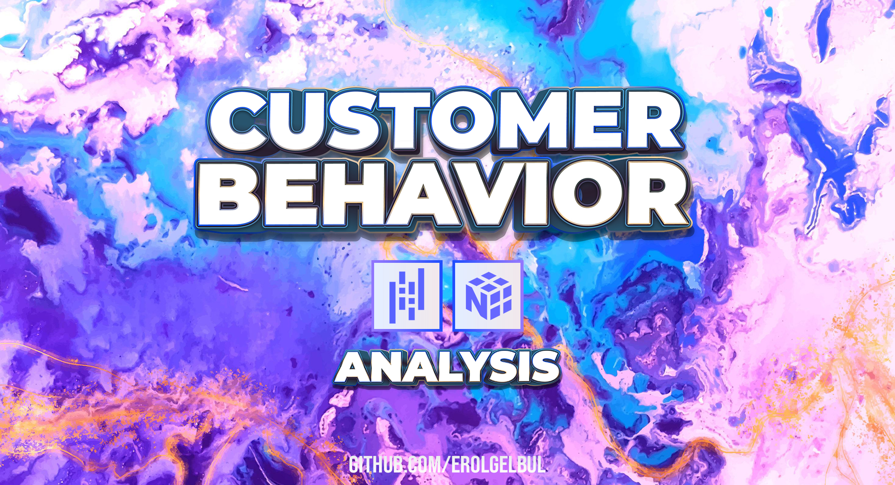

  

<!-- ABOUT THE PROJECT -->
## 1. Introduction

In this analysis, the primary goal is to explore the relationships between
transaction data, customer demographics, and product categories to gain insights
into customer behavior and preferences. The code conducts a time-based analysis
to understand sales trends over time, and examines the impact of demographics on
sales performance. Furthermore, the analysis delves into the performance of
different product categories among various age groups. The findings can help
inform marketing strategies, product offerings, and customer segmentation
efforts for better business decision-making.

## 1.1 Libraries

- [NumPy](https://numpy.org/)
- [pandas](https://pandas.pydata.org/)

<!-- CONTACT -->
## 2. Contact

Erol Gelbul - [Website](erolgelbul.com)

Project Link: [Customer Behavior Analysis](https://github.com/ErolGelbul/customer_behavior_analysis)
